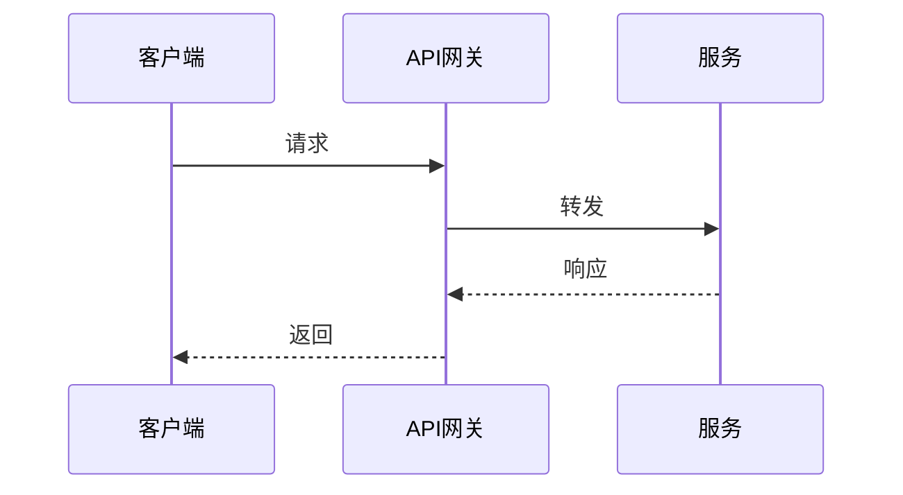

# API 接口文档模板

## 文档信息

| 项目 | 内容 |
|------|------|
| 文档名称 | API_[模块名] |
| 版本 | Vx.y.z |
| 日期 | YYYY-MM-DD |
| 状态 | 📝 草稿 / 👀 评审中 / ✅ 已批准 / 📦 已归档 |

> 📎 **关联文档**：基于 PRD `vX.Y.Z` 编写

---

## 1. 修改记录

| 序号 | 版本 | 日期（YYYY-MM-DD HH:MM:SS） | 修改内容 | 原因 | 影响范围 | 状态 |
|------|------|---------------------------|----------|------|----------|------|
| 1 | 1.0.0 | 2026-04-24 17:09:30 | 初始版本创建 | 接口上线 | 全文档 | 📝 草稿 |

---

## 2. 接口概览

| 接口 | 方法 | 路径 | 说明 | 版本 |
|------|------|------|------|------|
| 创建订单 | POST | `/api/orders` | ... | v1 |

---

## 3. 接口详情

### 3.1 [接口名称]

**请求：**
- 方法：POST
- 路径：`/api/orders`
- Headers：...

**请求参数：**

| 字段 | 类型 | 必填 | 说明 | 示例 |
|------|------|------|------|------|
| order_id | string | 是 | 订单ID | "ORD001" |

**响应参数：**

| 字段 | 类型 | 说明 | 示例 |
|------|------|------|------|
| code | int | 状态码 | 200 |

**错误码：**

| 错误码 | 含义 | 触发条件 |
|--------|------|----------|
| 40001 | 参数缺失 | 必填字段为空 |

**调用示例：**

```json
// 请求
{
  "order_id": "ORD001"
}

// 响应
{
  "code": 200,
  "data": {}
}
```

---

## 4. 数据流向图

**必须附 Mermaid 时序图** 展示接口调用链


