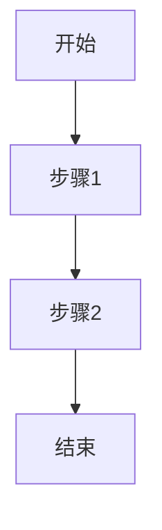

# BRD 商业需求文档模板

## 文档信息

| 项目 | 内容 |
|------|------|
| 文档名称 | BRD_[项目名称] |
| 版本 | Vx.y.z |
| 日期 | YYYY-MM-DD |
| 状态 | 📝 草稿 / 👀 评审中 / ✅ 已批准 / 📦 已归档 |

> 📎 **关联文档**：`MRD vX.Y.Z` | `PRD vX.Y.Z`（若已存在）

---

## 1. 修改记录

| 序号 | 版本 | 日期（YYYY-MM-DD HH:MM:SS） | 修改内容 | 原因 | 影响范围 | 状态 |
|------|------|---------------------------|----------|------|----------|------|
| 1 | 1.0.0 | 2026-04-24 17:09:30 | 初始版本创建 | 项目启动 | 全文档 | 📝 草稿 |

---

## 2. 商业目标

简述项目核心价值（1-2 句话）

---

## 3. 市场机会

目标市场规模或痛点分析（**必须附数据来源或假设依据**）

---

## 4. ROI 预估

投入与产出预估（可选，若无法提供则注明"待评估"）

---

## 5. 核心流程图

必须包含 **Mermaid 流程图** 展示整体业务闭环

