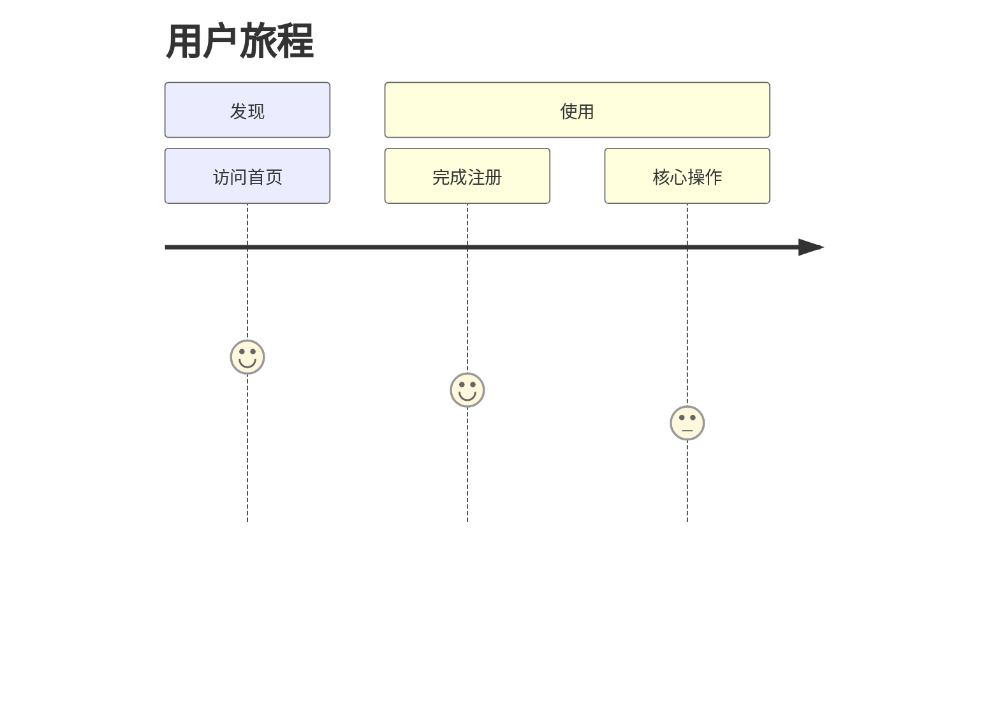

# MRD 市场需求文档模板

## 文档信息

| 项目 | 内容 |
|------|------|
| 文档名称 | MRD_[产品名称] |
| 版本 | Vx.y.z |
| 日期 | YYYY-MM-DD |
| 状态 | 📝 草稿 / 👀 评审中 / ✅ 已批准 / 📦 已归档 |

> 📎 **关联文档**：`BRD vX.Y.Z` | `PRD vX.Y.Z`（若已存在）

---

## 1. 修改记录

| 序号 | 版本 | 日期（YYYY-MM-DD HH:MM:SS） | 修改内容 | 原因 | 影响范围 | 状态 |
|------|------|---------------------------|----------|------|----------|------|
| 1 | 1.0.0 | 2026-04-24 17:09:30 | 初始版本创建 | 项目启动 | 全文档 | 📝 草稿 |

---

## 2. 用户画像

谁是主要用户？核心痛点是什么？（列表形式）

- **用户群体A**：...
- **用户群体B**：...

---

## 3. 竞品分析

至少列出 2 个竞品的优劣势对比（**必须使用表格**）

| 竞品 | 优势 | 劣势 | 差异化机会 |
|------|------|------|------------|
| 竞品A | ... | ... | ... |
| 竞品B | ... | ... | ... |

---

## 4. 功能范围界定

本次迭代**做**与**不做**的明确清单（列表对比）

**✅ 范围内：**
- ...

**❌ 范围外：**
- ...

---

## 5. 用户路径图

必须包含 **Mermaid 用户旅程图** 或 **时序图**

