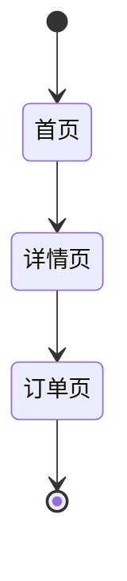

# PRD 产品需求文档模板

## 文档信息

| 项目 | 内容 |
|------|------|
| 文档名称 | PRD_[功能名称] |
| 版本 | Vx.y.z |
| 日期 | YYYY-MM-DD |
| 状态 | 📝 草稿 / 👀 评审中 / ✅ 已批准 / 📦 已归档 |

> 📎 **关联文档**：`BRD vX.Y.Z` | `MRD vX.Y.Z`

---

## 1. 修改记录

| 序号 | 版本 | 日期（YYYY-MM-DD HH:MM:SS） | 修改内容 | 原因 | 影响范围 | 状态 |
|------|------|---------------------------|----------|------|----------|------|
| 1 | 1.0.0 | 2026-04-24 17:09:30 | 初始版本创建 | 项目启动 | 全文档 | 📝 草稿 |

---

## 2. 功能详述

交互说明、边界条件

---

## 3. 页面流转图

必须包含 **Mermaid 状态图** 展示页面间的跳转关系

---

## 4. 验收标准

明确的 Checklist

- [ ] 标准1：...
- [ ] 标准2：...
- [ ] 标准3：...
