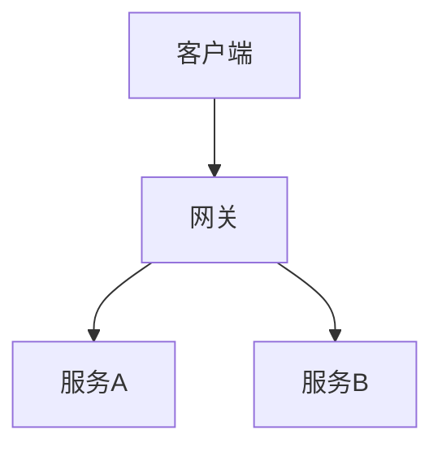

# RFC 技术提案模板

## 元信息

| 字段 | 内容 |
|------|------|
| 编号 | RFC-XXX |
| 状态 | 📝 草稿 / 👀 评审中 / ✅ 已批准 / 🚫 已驳回 |
| 日期 | YYYY-MM-DD |
| 提案人 | [姓名/团队] |
| 关联 ADR | ADR-XXX（批准后填写） |

> 📎 **关联文档**：关联 PRD `vX.Y.Z`。若已生成 ADR，标注 `ADR-XXX`

---

## 1. 摘要（Summary）

一句话概括提案内容

---

## 2. 动机（Motivation）

为什么需要这个变更（1-3 段）

---

## 3. 详细设计（Detailed Design）

### 3.1 技术方案描述

**必须附 Mermaid 架构图**

### 3.2 影响范围

哪些模块/服务受影响

### 3.3 兼容性分析

是否向后兼容

---

## 4. 实施计划

| 阶段 | 内容 | 预计时间 | 负责人 |
|------|------|----------|--------|
| 阶段1 | ... | ... | ... |
| 阶段2 | ... | ... | ... |

---

## 5. 风险与缓解

| 风险 | 影响 | 缓解措施 |
|------|------|----------|
| ... | 高/中/低 | ... |

---

## 6. 修改记录

| 序号 | 日期 | 修改内容 | 状态 |
|------|------|----------|------|
| 1 | 2026-04-24 | 初始创建 | 📝 草稿 |
