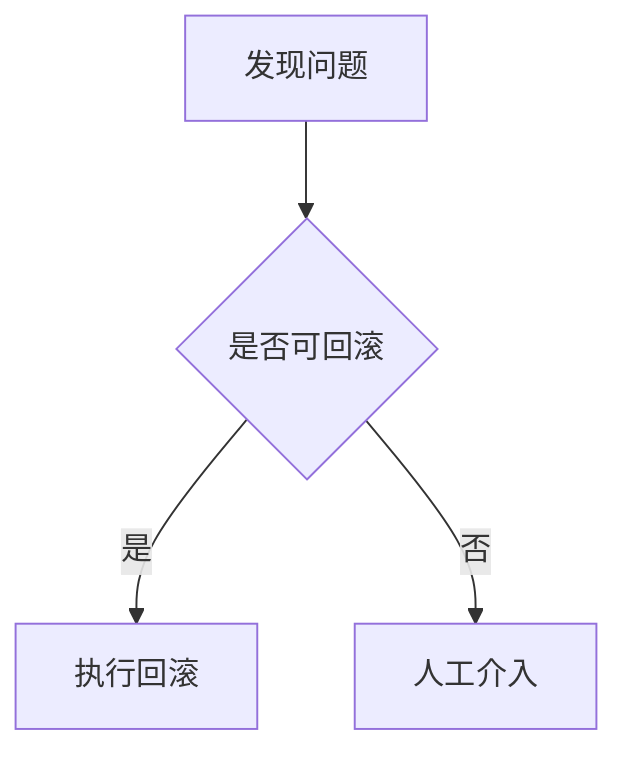

# Runbook 运维手册模板

## 文档信息

| 项目 | 内容 |
|------|------|
| 文档名称 | Runbook_[主题] |
| 日期 | YYYY-MM-DD |
| 状态 | ✅ 已批准 |

> 📎 **关联文档**：关联 ADR-XXX（若由架构决策驱动）

---

## 1. 修改记录

| 序号 | 日期 | 修改内容 | 影响范围 |
|------|------|----------|----------|
| 1 | 2026-04-24 | 初始创建 | 全文档 |

---

## 2. 概述

本 Runbook 解决什么问题（1-2 句话）

---

## 3. 前置条件

执行前需要确认的环境/权限/工具

---

## 4. 操作步骤

| 步骤 | 操作 | 预期结果 | 回退方案 |
|------|------|----------|----------|
| 1 | ... | ... | ... |
| 2 | ... | ... | ... |

---

## 5. 验证方法

如何确认操作成功

---

## 6. 常见问题

| 问题 | 原因 | 解决方案 |
|------|------|----------|
| ... | ... | ... |

---

## 7. 回滚流程（如有）

**必须附 Mermaid 流程图**

