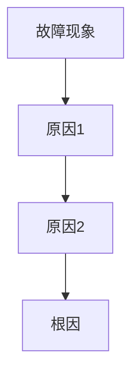

# 事故复盘（Post-mortem）模板

## 文档信息

| 项目 | 内容 |
|------|------|
| 文档名称 | Postmortem_[YYYYMMDD]_[事故简称] |
| 日期 | YYYY-MM-DD |
| 状态 | ✅ 已完成 |

> 📎 **关联文档**：关联 Runbook_[主题]（若涉及运维流程）

---

## 1. 事故概要

| 字段 | 内容 |
|------|------|
| 事故名称 | ... |
| 发生时间 | YYYY-MM-DD HH:MM |
| 恢复时间 | YYYY-MM-DD HH:MM |
| 影响时长 | X小时X分钟 |
| 影响范围 | ... |
| 严重等级 | P0/P1/P2/P3 |

---

## 2. 时间线

| 时间 | 事件 |
|------|------|
| HH:MM | 监控告警触发 |
| HH:MM | 值班确认故障 |
| HH:MM | 定位根因 |
| HH:MM | 服务恢复 |

---

## 3. 根因分析

5-Why 或其他分析方法（**必须附 Mermaid 因果图**）

---

## 4. 影响评估

用户影响、业务影响、数据影响

---

## 5. 改进措施（Action Items）

| 编号 | 改进项 | 负责人 | 截止日期 | 状态 |
|------|--------|--------|----------|------|
| 1 | ... | ... | ... | 🆕 待处理 |
| 2 | ... | ... | ... | 🔄 进行中 |
| 3 | ... | ... | ... | ✅ 已完成 |

---

## 6. 经验总结

3-5 条关键 takeaway

1. ...
2. ...
3. ...
