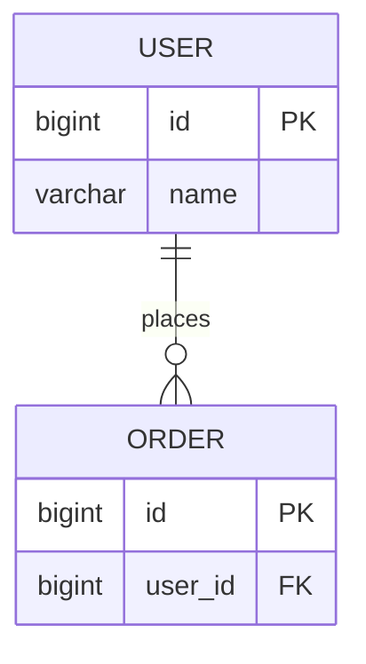

# 数据字典模板

## 文档信息

| 项目 | 内容 |
|------|------|
| 文档名称 | 数据字典_[主题] |
| 日期 | YYYY-MM-DD |
| 状态 | ✅ 已批准 |

> 📎 **关联文档**：关联 PRD `vX.Y.Z` 和 API 文档 `vX.Y.Z`

---

## 1. 修改记录

| 序号 | 日期 | 修改内容 | 影响范围 |
|------|------|----------|----------|
| 1 | 2026-04-24 | 初始创建 | 全文档 |

---

## 2. 表结构

| 字段名 | 类型 | 是否主键 | 是否允许NULL | 默认值 | 说明 |
|--------|------|----------|-------------|--------|------|
| id | BIGINT | 是 | 否 | AUTO_INCREMENT | 主键 |
| name | VARCHAR(64) | 否 | 否 | - | 用户名 |

---

## 3. 索引信息

| 索引名 | 类型 | 字段 | 说明 |
|--------|------|------|------|
| idx_name | UNIQUE | name | 用户名唯一 |

---

## 4. ER 关系图

**必须附 Mermaid ER 图**

